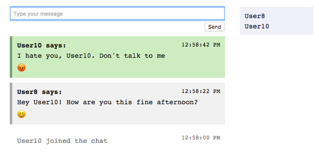

# sentiment chat

Sentiment Chat is a full-stack web application which allows users to send messages to one another via a web front-end, websocket, and java server. As users send text messages to one another, their messages are also sent to a third-party natural language processing service for sentiment analysis. As sentiment analysis results come back (asynchronously), the server sends those results to the chat clients, and the clients decorate messages with emoticons indicating the message's sentiment: (negative) 😡 <-> 😂 (positive).

I started from [this example](https://sparktutorials.github.io/2015/11/08/spark-websocket-chat), but deviated significantly.  The most significant deviation was in adding the sentiment analysis functionality.  I'm proud that my chosen design allows messages to be distributed to users synchronously, but the sentiment analysis is performed offline and joined with the messages asynchronously.

The server logic is written in Java, with Maven as the build system, and Jetty as a servlet engine and HTTP server.  The client logic is written in vanilla Javascript and vanilla CSS.  This is a very small application, and therefore lacks certain infrastructure that would be present in a larger application such as dependency injection, unit tests, increased modularity, and a UI build system.  My next step would be to introduce dependency injection into the server so that I could inject mocked services and write effective tests: as it is now, the classes are too tightly coupled.

